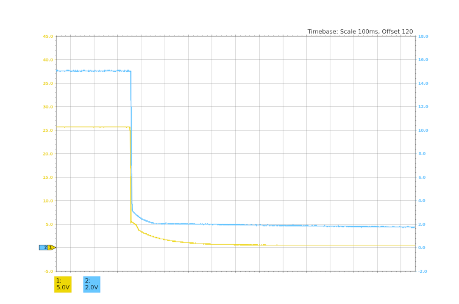

# Owon PDS6062T relay server

This repo allows to control Owon oscilloscope via network through a relay host (cf. `./relay_srv.py -h`).
Relay host automatically reads screen data and sends it via websocket to all connected clients:

 - cf. `./live_view.py -h` displays data provided by relay server
 - cf. `./live_dump.py -h` dumps data provided by relay server allowing for later reconstruction or processing (`./dump_reconstruct.py -h`)

Clients may control the oscilloscope via two REST API requests (cf. `./interact_cmd.py -h`).

To get real voltage values out of data dumps cf. `get_real_values()` function.

As of now this is usable for slow events only. At the same time no furhter work on this repo is planned.

## Prerequisites

```
$ apt install pyusb python-usbtmc

$ cat /etc/udev/rules.d/usbtmc.rules
# USBTMC instruments

# 5345:1234 Owon PDS6062T Oscilloscope
SUBSYSTEMS=="usb", ATTRS{idVendor}=="5345", ATTRS{idProduct}=="1234", GROUP="users", MODE="0666"

$ udevadm control --reload-rules && udevadm trigger

$ pip install -r requirements.txt
```

## Forwarding oscilloscope view via network

- Start `./relay_srv.py` on the PC 1. with connected oscilloscope
- Find the IP address of the PC 1
- On the PC 2 where you wish to view the oscilloscope start `./live_view.py -t<PC 1 IP address>`



### Commanding oscilloscope via network

- Start `./interact_cmd.py -t<PC 1 IP address>`

cf. internals of the `interact_cmd.py` and use it in arbitrary python script

## Notes

 - make sure the PC is set and not the USBTMC or PICT in menu: Home -> Utility -> Function -> Output -> Device
 - reading the data out of oscilloscope via ethernet socket seemed to be approx. four times slower than using USB
 - ! setting trigger to SINGle or NORMal via USB commands did not work> screen got stuck and no triggers occurred (IDN: OWON,TAO3122,2217150,V2.5.0 ; tested with 100 ms base only)

---

`:DATA:WAVE:DEPMem:All?` response scheme:

- 4 Bytes of full message length
  - 4 Bytes of JSON header length
    - header
  - 4 Bytes of ch1 length
    - ch1 data
  - 4 Bytes of ch2 length
    - ch2 data

DEPMem:All allows for faster readout, however the mem seems to be cleared by the readout
